# RatRace2025 - Technical Architecture

## Non-Technical Perspective

Think of RatRace2025's architecture like a well-designed factory. The factory has different departments (layers) that each handle specific tasks, with clear interfaces between them. Raw materials (financial data) enter one end, get processed through various stages, and emerge as finished products (simulation results and visualizations).

The architecture emphasizes:
- **Modularity**: Each part can be understood and modified independently
- **Extensibility**: New features can be added without breaking existing functionality
- **Testability**: Each component can be tested in isolation
- **Maintainability**: Clear separation of concerns makes the codebase easier to understand and modify

## Technical Architecture Overview

RatRace2025 follows Domain-Driven Design (DDD) principles with a layered architecture, implemented in Java using Spring Boot patterns.

### System Layers

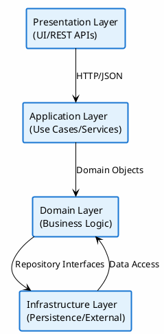

### Core Components

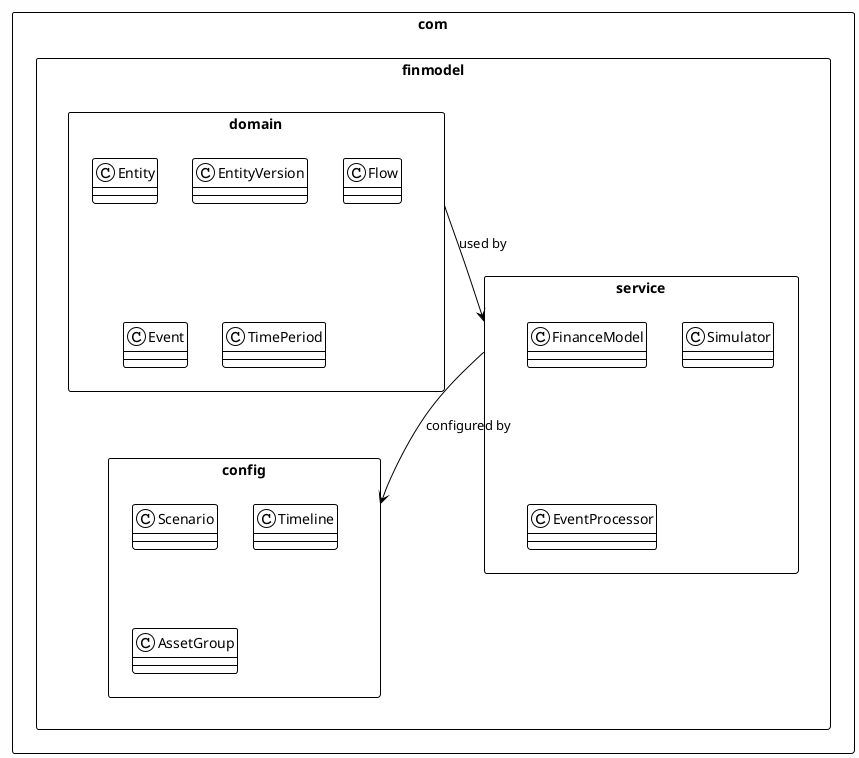

## Domain Layer Deep Dive

The domain layer contains the core business logic and rules that govern financial modeling.

### Entity Lifecycle

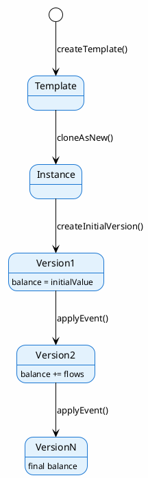

### Flow Generation Process

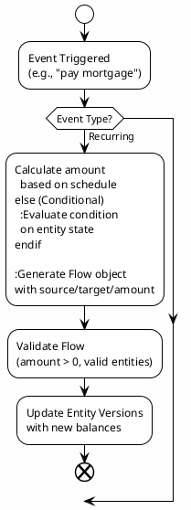

## Service Layer Architecture

### Simulation Engine

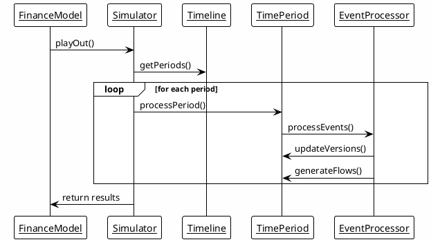

### Key Design Patterns

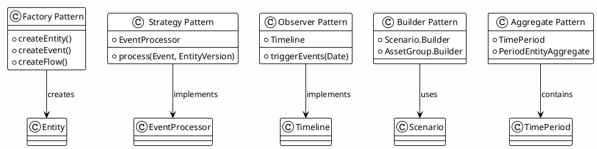

## Data Structures and Relationships

### Core Domain Objects

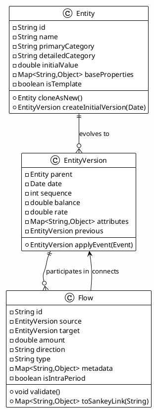

### Aggregation Structures

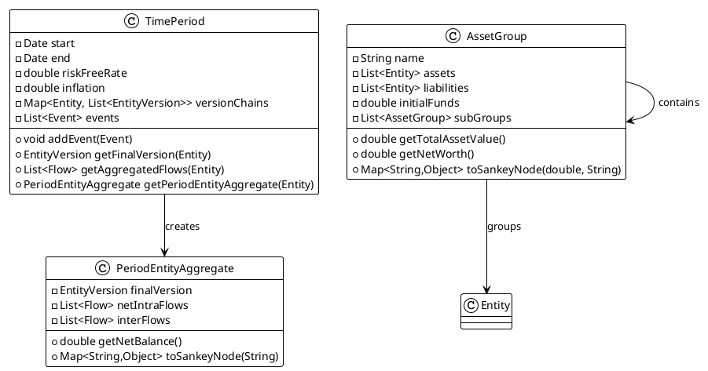

## Configuration and Setup

### Scenario Configuration

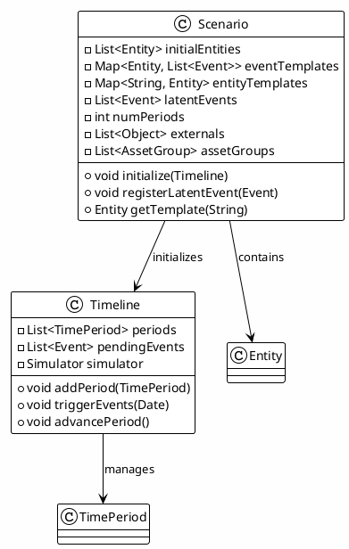

## Error Handling and Validation

### Validation Strategy

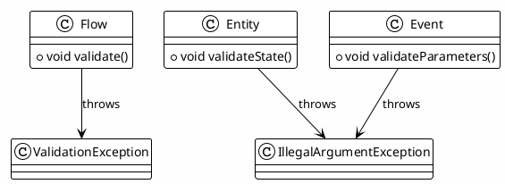

### Error Recovery Patterns

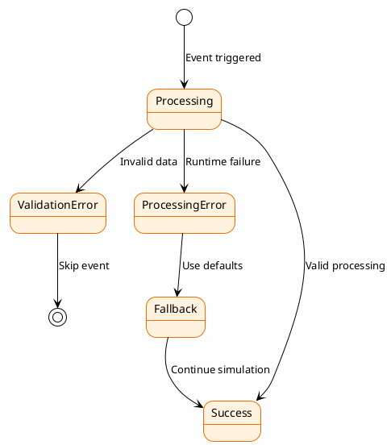

## Testing Strategy

### Test Pyramid

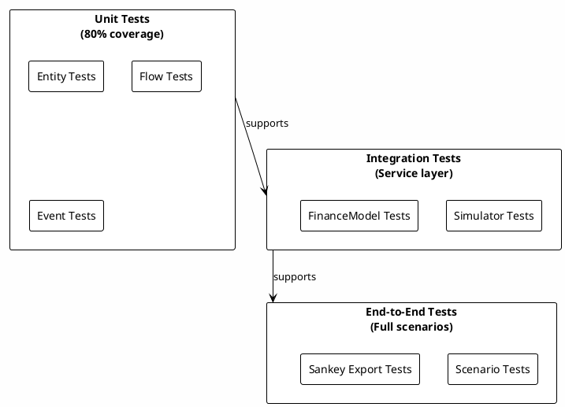

## Performance Considerations

### Caching Strategy

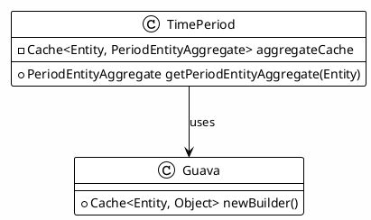

### Optimization Techniques

- **Lazy Evaluation**: PeriodEntityAggregate created on demand
- **Caching**: Expensive calculations cached per period
- **Streaming**: Large datasets processed with Java streams
- **Immutable Objects**: EntityVersion prevents accidental mutation

## Extensibility Points

### Plugin Architecture

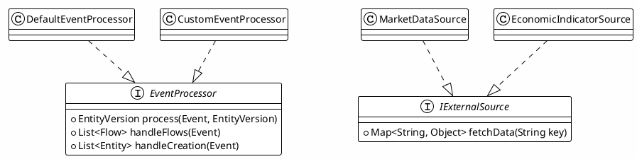

## Deployment and Packaging

### Build and Dependencies

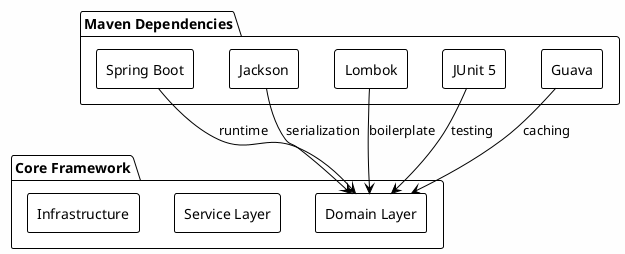

This architecture provides a solid foundation for financial modeling while maintaining flexibility for future enhancements and UI integrations.