# Entities and Flows - Domain Modeling

## Non-Technical Perspective

Imagine you're tracking different aspects of your personal finances. You have bank accounts, investments, loans, and income sources - these are all **entities** in your financial world. The money moving between these entities - like transferring from checking to savings, or paying your mortgage - are **flows**.

RatRace2025 models your entire financial ecosystem as a network of these entities connected by flows, showing how money moves through your financial life over time.

### Real-World Analogy

Think of a city's water system:
- **Reservoirs, pipes, and treatment plants** are like your entities (savings accounts, investment portfolios, income sources)
- **The water flowing through the pipes** represents money flows
- **Valves and pumps** are like events that control when and how much water (money) moves

Just as a city's water system must balance supply and demand, your financial system must balance income and expenses to achieve your goals.

## Entity Modeling

### Entity Types and Categories

RatRace2025 supports a comprehensive taxonomy of financial entities, organized hierarchically:

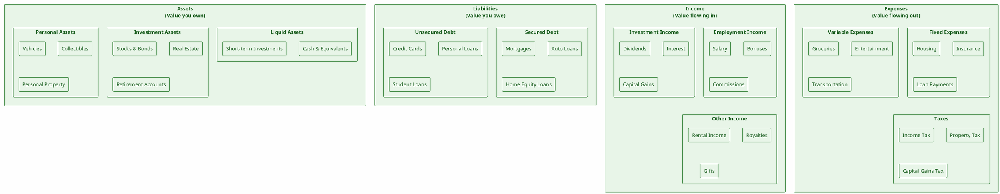

### Entity Lifecycle

Every entity in RatRace2025 has a complete lifecycle from creation to evolution:

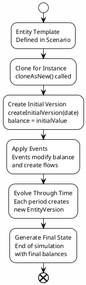

### Entity Properties and Metadata

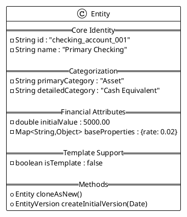

## Flow Modeling

### Flow Types and Characteristics

Flows represent money movement between entities. RatRace2025 distinguishes between different types of flows:

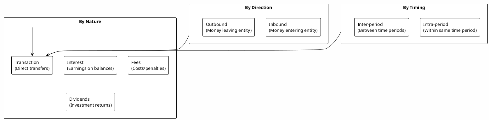

### Flow Lifecycle

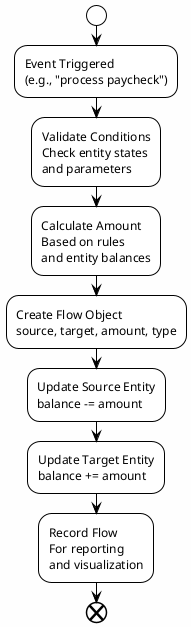

### Flow Properties and Metadata

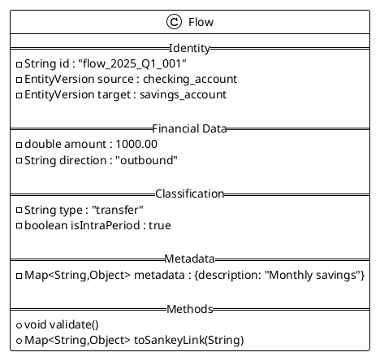

## Entity-Version Relationships

### Version Chain Pattern

Each entity maintains a chain of versions representing its state at different points in time:

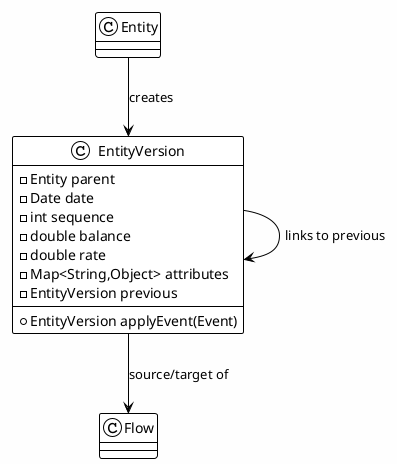

### Time Period Aggregation

Within each time period, entities have aggregated views showing net changes:

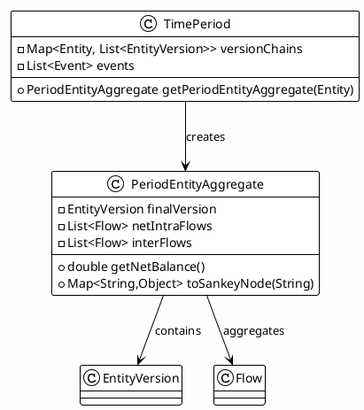

## Grouping and Hierarchy

### Asset Group Organization

Entities can be organized into hierarchical groups for portfolio management:

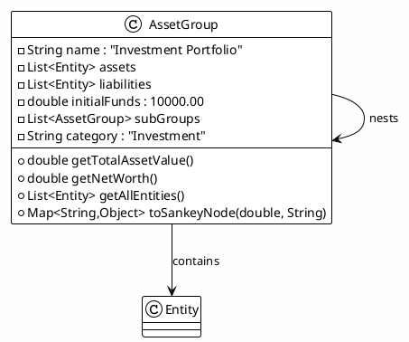

### Hierarchical Navigation

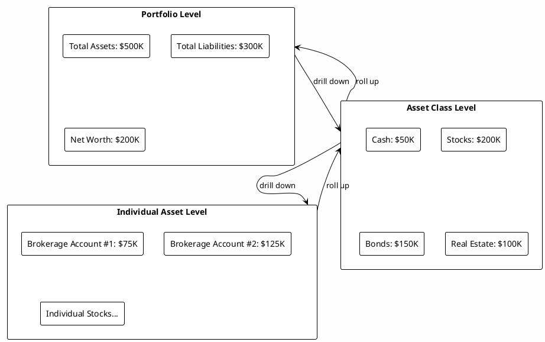

## Event-Driven Flow Generation

### Event Types and Flow Creation

Different types of events generate different types of flows:

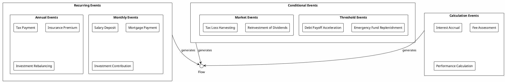

### Event Processing Pipeline

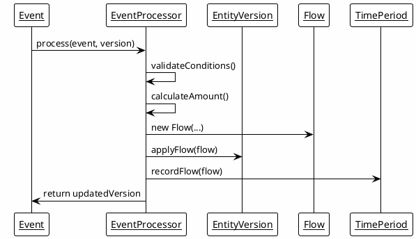

## Data Validation and Integrity

### Entity Validation Rules

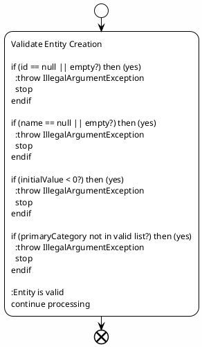

### Flow Validation Rules

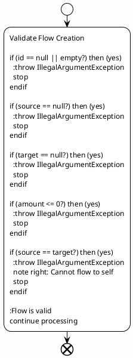

## Performance Optimization

### Caching Strategies

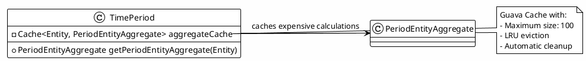

### Lazy Evaluation

```plantuml
@startuml Lazy Evaluation
!theme plain
skinparam backgroundColor #FEFEFE

start
:Request PeriodEntityAggregate

if (cache contains entity?) then (yes)
  :return cached result
else (no)
  :calculate final version
  :aggregate flows
  :create PeriodEntityAggregate
  :store in cache
  :return result
endif

end
@enduml
```

This comprehensive entity and flow modeling system provides the foundation for accurate financial simulations and rich visualizations in RatRace2025.