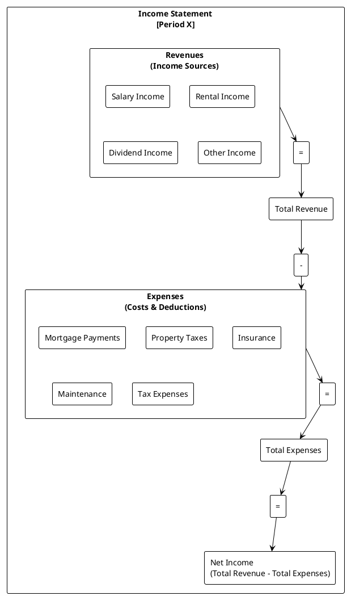
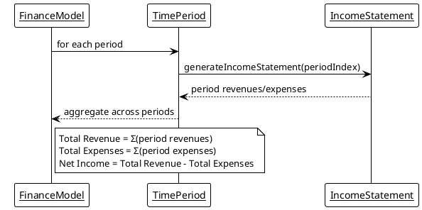
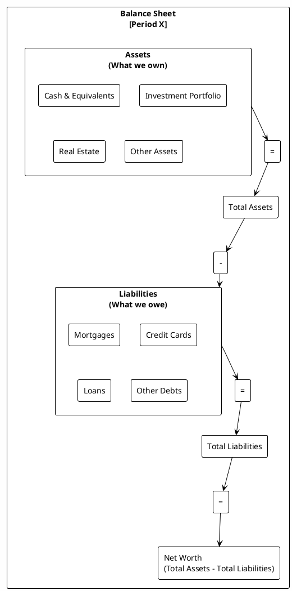
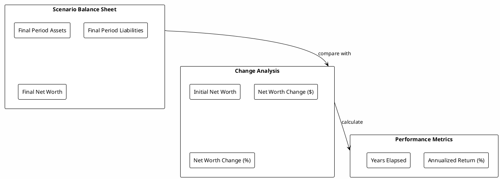

# Financial Reporting - Income Statements and Balance Sheets

**Last Updated**: 2025-10-14

## Overview

RatRace2025 provides comprehensive financial reporting capabilities that generate traditional accounting-style Income Statements and Balance Sheets. These reports are available for individual time periods and aggregated across entire scenarios, enabling detailed analysis of financial performance and position.

### Key Features

- **Period-Specific Reports**: Income Statements and Balance Sheets for any simulation period
- **Scenario-Wide Aggregation**: Cumulative financial reports across all periods
- **Professional Formatting**: Accounting-style formatted reports for presentation
- **Multi-Category Classification**: Detailed breakdown by entity types and categories
- **Performance Metrics**: Net income, net worth, and growth calculations

## Income Statement

### Purpose

An Income Statement (also called Profit & Loss or P&L) shows revenues, expenses, and resulting net income over a specific time period. It answers the question: "How much money did we make or lose during this period?"

### Period-Specific Income Statement

#### Structure



#### Data Sources

**Revenues (Income entities):**
- Salary income from employment
- Rental income from properties
- Dividend income from investments
- Interest income from savings/cash
- Other miscellaneous income

**Expenses (Expense entities):**
- Mortgage payments (principal + interest)
- Property taxes and insurance
- Maintenance and repair costs
- Tax liabilities (Income Tax, NI, CGT)
- Other operational expenses

#### Calculation Logic

```java
// Revenue aggregation
for (Entity entity : incomeEntities) {
    double balance = period.getPeriodEntityAggregate(entity).getNetBalance();
    revenues.put(entity.getDetailedCategory(), balance);
    totalRevenue += balance;
}

// Expense aggregation (expenses are stored as negative balances)
for (Entity entity : expenseEntities) {
    double balance = period.getPeriodEntityAggregate(entity).getNetBalance();
    expenses.put(entity.getDetailedCategory(), Math.abs(balance)); // Display as positive
    totalExpenses += Math.abs(balance);
}

// Net income calculation
netIncome = totalRevenue - totalExpenses;
```

### Scenario-Wide Income Statement

#### Aggregation Approach

The scenario-wide Income Statement aggregates data across all periods in the simulation:



#### Additional Metrics

**Period Count**: Total number of periods in the scenario
**Average Monthly Figures**:
- Average monthly revenue
- Average monthly expenses
- Average monthly net income

**Trend Analysis**:
- Revenue growth over time
- Expense patterns
- Net income consistency

## Balance Sheet

### Purpose

A Balance Sheet shows financial position at a specific point in time, displaying assets, liabilities, and resulting net worth. It answers the question: "What do we own, what do we owe, and what's our net financial position?"

### Period-Specific Balance Sheet

#### Structure



#### Data Sources

**Assets:**
- Cash and cash equivalents (checking, savings)
- Investment portfolios (stocks, bonds, crypto)
- Real estate holdings (property values)
- Personal assets (vehicles, valuables)

**Liabilities:**
- Mortgage balances
- Credit card debt
- Personal loans
- Other outstanding debts

#### Calculation Logic

```java
// Asset aggregation
for (Entity entity : assetEntities) {
    double balance = period.getPeriodEntityAggregate(entity).getNetBalance();
    assets.put(entity.getDetailedCategory() + " - " + entity.getName(), balance);
    totalAssets += balance;
}

// Liability aggregation (liabilities stored as negative balances)
for (Entity entity : liabilityEntities) {
    double balance = period.getPeriodEntityAggregate(entity).getNetBalance();
    liabilities.put(entity.getDetailedCategory() + " - " + entity.getName(), Math.abs(balance));
    totalLiabilities += Math.abs(balance);
}

// Net worth calculation
netWorth = totalAssets - totalLiabilities;
```

### Scenario-Wide Balance Sheet

#### Final Position Focus

The scenario-wide Balance Sheet shows the final financial position after all periods:



#### Change Analysis

**Initial vs Final Comparison:**
- Initial net worth (period 0)
- Final net worth (last period)
- Absolute change in dollars
- Percentage change

**Annualized Performance:**
```java
// Annualized return calculation
int yearsElapsed = totalPeriods / 12; // Assuming monthly periods
if (yearsElapsed > 0 && initialNetWorth > 0) {
    double annualizedReturn = Math.pow((finalNetWorth / initialNetWorth), 1.0 / yearsElapsed) - 1;
    annualizedReturnPercentage = annualizedReturn * 100.0;
}
```

## Formatted Report Generation

### Professional Presentation

Both Income Statements and Balance Sheets are available in formatted text reports suitable for display and printing:

```java
public String generateFormattedIncomeStatement(Map<String, Object> data) {
    StringBuilder report = new StringBuilder();
    report.append("INCOME STATEMENT\n");
    report.append("================\n\n");

    // Revenues section
    report.append("REVENUES:\n");
    @SuppressWarnings("unchecked")
    Map<String, Double> revenues = (Map<String, Double>) data.get("revenues");
    revenues.forEach((category, amount) ->
        report.append(String.format("  %-20s £%,15.2f\n", category + ":", amount))
    );

    // Total revenue
    double totalRev = (Double) data.get("totalRevenue");
    report.append(String.format("  %-20s £%,15.2f\n", "Total Revenue:", totalRev));

    // Expenses section
    report.append("\nEXPENSES:\n");
    @SuppressWarnings("unchecked")
    Map<String, Double> expenses = (Map<String, Double>) data.get("expenses");
    expenses.forEach((category, amount) ->
        report.append(String.format("  %-20s £%,15.2f\n", category + ":", amount))
    );

    // Total expenses and net income
    double totalExp = (Double) data.get("totalExpenses");
    double netIncome = (Double) data.get("netIncome");
    report.append(String.format("  %-20s £%,15.2f\n", "Total Expenses:", totalExp));
    report.append(String.format("  %-20s £%,15.2f\n", "Net Income:", netIncome));

    return report.toString();
}
```

### Report Integration

#### Period Details Context

Financial reports are integrated into period details for UI consumption:

```java
public Map<String, Object> getPeriodDetails(int periodIndex) {
    Map<String, Object> details = new HashMap<>();

    // Basic period information
    details.put("periodIndex", periodIndex);
    details.put("economicFactors", getPeriodEconomicFactors(periodIndex));

    // Financial reports
    Map<String, Object> financialReports = getFormattedFinancialReports(periodIndex);
    details.put("formattedIncomeStatement", financialReports.get("formattedIncomeStatement"));
    details.put("formattedBalanceSheet", financialReports.get("formattedBalanceSheet"));

    // Investment analysis
    details.put("roiSummary", generatePeriodROI(periodIndex));

    return details;
}
```

#### Scenario Summary

Complete scenario financial overview includes both income and balance sheet summaries:

```java
public Map<String, Object> getScenarioSummary() {
    Map<String, Object> summary = new HashMap<>();

    // Scenario-wide financial reports
    Map<String, Object> scenarioReports = getScenarioFinancialReports();
    summary.put("scenarioIncomeStatement", scenarioReports.get("scenarioIncomeStatement"));
    summary.put("scenarioBalanceSheet", scenarioReports.get("scenarioBalanceSheet"));
    summary.put("formattedScenarioIncomeStatement", scenarioReports.get("formattedScenarioIncomeStatement"));
    summary.put("formattedScenarioBalanceSheet", scenarioReports.get("formattedScenarioBalanceSheet"));

    // Performance metrics
    summary.put("totalPeriods", timeline.getPeriods().size());
    summary.put("netWorthGrowth", calculateNetWorthGrowth());
    summary.put("averageMonthlyNetIncome", calculateAverageMonthlyNetIncome());

    return summary;
}
```

## API Methods

### Period-Specific Reports

```java
// Generate income statement for specific period
Map<String, Object> generateIncomeStatement(int periodIndex)

// Generate balance sheet for specific period
Map<String, Object> generateBalanceSheet(int periodIndex)

// Get formatted financial reports for period
Map<String, Object> getFormattedFinancialReports(int periodIndex)

// Get complete period details including financial reports
Map<String, Object> getPeriodDetails(int periodIndex)
```

### Scenario-Wide Reports

```java
// Generate aggregated income statement across all periods
Map<String, Object> generateScenarioIncomeStatement()

// Generate final balance sheet with change analysis
Map<String, Object> generateScenarioBalanceSheet()

// Get formatted scenario financial reports
Map<String, Object> getFormattedScenarioFinancialReports()

// Get comprehensive scenario summary
Map<String, Object> getScenarioSummary()
```

## Usage Examples

### Command Line Dump Integration

Financial reports are automatically included in the console dump:

```
=== FINANCIAL REPORTS (Period 12) ===

INCOME STATEMENT
================

REVENUES:
  Salary Income:         £75,000.00
  Rental Income:          £2,500.00
  Dividend Income:          £500.00
  Total Revenue:         £78,000.00

EXPENSES:
  Mortgage Payment:      £15,000.00
  Property Tax:           £1,200.00
  Insurance:                £600.00
  Income Tax:            £13,500.00
  National Insurance:     £4,500.00
  Total Expenses:         £34,800.00

Net Income:              £43,200.00

BALANCE SHEET
=============

ASSETS:
  Cash & Equivalents - Primary Checking:    £15,000.00
  Investment Portfolio - Retirement Fund:   £150,000.00
  Real Estate - Primary Residence:          £320,000.00
  Total Assets:                             £485,000.00

LIABILITIES:
  Secured Debt - Primary Mortgage:          £280,000.00
  Total Liabilities:                        £280,000.00

Net Worth:                                 £205,000.00
```

### UI Integration

Financial reports provide data structures for rich UI visualization:

```javascript
// Period details for context pane
{
  "periodIndex": 12,
  "economicFactors": {...},
  "formattedIncomeStatement": "...",
  "formattedBalanceSheet": "...",
  "roiSummary": {...}
}

// Scenario summary for dashboard
{
  "scenarioIncomeStatement": {...},
  "scenarioBalanceSheet": {...},
  "formattedScenarioIncomeStatement": "...",
  "formattedScenarioBalanceSheet": "...",
  "totalPeriods": 60,
  "netWorthGrowth": 125.5
}
```

## Implementation Notes

### Thread Safety

Financial report generation uses `AtomicReference` for thread-safe aggregation across periods:

```java
AtomicReference<Double> totalRevenue = new AtomicReference<>(0.0);
AtomicReference<Double> totalExpenses = new AtomicReference<>(0.0);

// Thread-safe updates in parallel streams
revenues.forEach((category, amount) -> {
    totalRevenue.updateAndGet(v -> v + (Double) amount);
});
```

### Error Handling

All financial reporting methods include comprehensive error handling:

```java
if (timeline == null || periodIndex < 0 || periodIndex >= timeline.getPeriods().size()) {
    Map<String, Object> error = new HashMap<>();
    error.put("error", "Invalid period index: " + periodIndex);
    return error;
}
```

### Performance Optimization

Reports are generated on-demand and cached at the period level to avoid redundant calculations during multiple report requests.

## Future Enhancements

- **Cash Flow Statements**: Operating, investing, and financing cash flows
- **Ratio Analysis**: Profitability, liquidity, and leverage ratios
- **Trend Charts**: Visual representation of financial performance over time
- **Comparative Analysis**: Side-by-side period comparisons
- **Forecasting**: Projected financial statements based on trends
- **Multi-Currency Support**: Reports in different currencies
- **Tax Impact Analysis**: Detailed tax efficiency breakdowns

## Code Examples

### Generating Reports
```java
// Generate income statement for a specific period
FinanceModel model = new FinanceModel();
model.loadFromJson("scenario.json");
model.runSimulation();

Map<String, Object> incomeStatement = model.generateIncomeStatement(12);
String formatted = model.generateFormattedIncomeStatement(incomeStatement);
System.out.println(formatted);
```

### UI Integration
```javascript
// Fetch and display financial reports in React component
const FinancialReports = ({ periodIndex }) => {
  const [reports, setReports] = useState(null);

  useEffect(() => {
    apiService.getPeriodDetails(periodIndex)
      .then(data => setReports(data))
      .catch(err => console.error('Failed to load reports', err));
  }, [periodIndex]);

  return (
    <div>
      <pre>{reports?.formattedIncomeStatement}</pre>
      <pre>{reports?.formattedBalanceSheet}</pre>
    </div>
  );
};
```

For complete repository examples, visit https://github.com/example/ratrace2025.

## See Also
- **[uk-tax-system.md](uk-tax-system.md)**: Tax calculations integrated into financial reports
- **[ui-visualization.md](ui-visualization.md)**: How reports are displayed in Sankey diagrams
- **[simulation-engine.md](simulation-engine.md)**: Data generation process
- **[backend-development-guide.md](backend-development-guide.md)**: Implementation phases