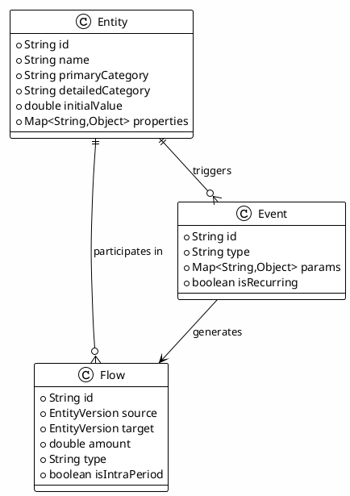
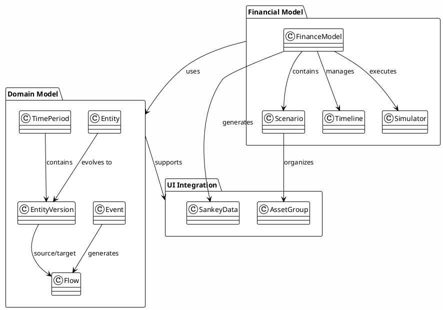
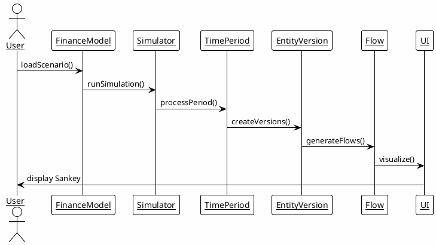

# RatRace2025 Financial Modeling Platform - Overview

## Non-Technical Introduction

Imagine you're trying to understand your financial future - how your savings grow, how your mortgage balance changes over time, or how different investment decisions might play out over the next 30 years. RatRace2025 is like a financial crystal ball that helps you visualize and understand complex money flows through time.

### What It Does

**RatRace2025** is a sophisticated financial simulation platform that models how money moves between different parts of your financial life. Think of it as a financial ecosystem simulator that shows:

- How your salary flows into savings and investments
- How mortgage payments reduce your debt over time
- How investments grow and generate returns
- How UK taxes (Income Tax, National Insurance, Capital Gains Tax) impact your take-home pay
- How tax-efficient strategies can optimize your financial outcomes
- How unexpected events (like bonuses, tax changes, or emergencies) affect your overall financial picture

### Why It Matters

Traditional financial planning often shows you static snapshots - "You'll have $X in 30 years." RatRace2025 shows you the **journey**, not just the destination. You can see:

- **The big picture**: How all your financial pieces work together
- **The details**: Exactly how much flows where and when
- **The what-ifs**: What happens if you change your strategy

### Real-World Analogy

Imagine you're watching a busy highway interchange at rush hour. Cars (representing money) are constantly entering and exiting different lanes (representing different financial accounts). Some cars merge onto highways (investments), others exit to neighborhoods (expenses), and traffic patterns change based on time of day and road conditions.

RatRace2025 gives you a bird's-eye view of this traffic flow, showing you not just where cars end up, but the entire journey they take.

## Technical Overview

RatRace2025 is built as a modular Java-based financial modeling framework using Domain-Driven Design principles. It provides both programmatic simulation capabilities and rich data structures for visualization.

### Core Concepts

### System Architecture

### Key Capabilities

#### 1. **Dynamic Entity Management**
- Assets (savings, investments, property)
- Liabilities (mortgages, loans, credit cards)
- Income streams (salary, dividends, rental income)
- Expense categories (utilities, insurance, taxes)

#### 2. **Time-Based Simulation**
- Configurable time periods (monthly, quarterly, annually)
- Event-driven changes (pay raises, market fluctuations, life events)
- Balance evolution tracking over time

#### 3. **Flow Visualization**
- Money movement tracking between entities
- Intra-period transfers (within same time period)
- Inter-period carryovers (between time periods)

#### 4. **Grouping and Hierarchy**
- Asset portfolios with sub-groupings
- Category-based organization
- Drill-down capabilities for detailed analysis

#### 5. **UK Tax Modeling**
- Comprehensive 2024/25 tax rules implementation
- Income Tax (Basic 20%, Higher 40%, Additional 45%)
- National Insurance employee contributions
- Capital Gains Tax with annual exemptions
- Scottish tax system support
- Person-centric tax efficiency monitoring
- Tax optimization suggestions and alerts

### Data Flow

## Getting Started

### For Business Users
Start with the [BDD Use Cases](./BDD/bdd-use-cases.md) to understand what scenarios the platform currently supports.

### For Developers
Continue with the [Architecture](./architecture.md) document for technical implementation details.

### For UI Developers
See the [UI Integration](./ui-integration.md) guide for visualization capabilities.

## Development Guidelines

For developers contributing to the project, follow these mandatory guidelines:

- [Backend Architecture](../guidelines/backend-architecture.md) - Development workflow and pre-commit requirements
- [Coding Standards](../guidelines/backend-coding-standards.md) - Code quality and documentation maintenance
- [Testing Guidelines](../guidelines/backend-testing-guidelines.md) - Unit, integration, and BDD testing requirements
- [Framework Patterns](../guidelines/backend-framework-patterns.md) - Design patterns and extension mechanisms

**All development must follow the [Mandatory Pre-Commit Checklist](../guidelines/backend-coding-standards.md#mandatory-pre-commit-checklist) before any commits.**

## Next Steps

This overview provides the foundation. The following documents dive deeper into specific aspects:

- [Architecture](./architecture.md) - Technical implementation details
- [Entities and Flows](./entities-and-flows.md) - Domain modeling concepts
- [Simulation Engine](./simulation-engine.md) - How simulations work
- [UI Integration](./ui-integration.md) - Visualization capabilities
- [BDD Use Cases](./BDD/bdd-use-cases.md) - Current functionality examples