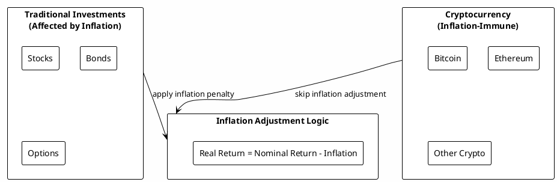

# Scenario Composition and Component-Based Modeling

## Non-Technical Perspective

Imagine you're building a financial model like assembling LEGO blocks. Instead of manually placing each tiny brick (individual entities and events), you use pre-built components like "house", "car", or "investment portfolio" blocks. Each component knows how to assemble itself into the right entities and events.

For a rental property, you just specify:
- Property value: $300,000
- Annual appreciation: 3%
- Mortgage amount: $240,000 at 4.5%
- Monthly rent: $2,500
- Ancillary costs: $300/month

The system automatically creates all the necessary accounts and transactions.

## Overview

RatRace2025 now supports **Scenario Components** - high-level abstractions that encapsulate related financial entities and their behaviors. Components provide:

- **Simplified scenario definition** using domain-specific language
- **Automatic entity and event creation** with proper relationships
- **Consistent financial modeling patterns** for common scenarios
- **Extensible architecture** for custom component types

## Component Architecture

### Core Component Interface

```java
public interface ScenarioComponent {
    String getId();
    String getName();
    List<Entity> getEntities();
    List<Event> getEvents();
    void validate() throws ValidationException;
    String describe();
}
```

### Component Registry

```java
public class ComponentRegistry {
    private Map<String, Supplier<ScenarioComponent>> componentFactories = new HashMap<>();

    public void register(String type, Supplier<ScenarioComponent> factory) {
        componentFactories.put(type, factory);
    }

    public ScenarioComponent create(String type, Map<String, Object> config) {
        // Create component with configuration
    }
}
```

## Rental Property Component

### Configuration Schema

```json
{
  "type": "rental_property",
  "id": "primary_residence",
  "propertyValue": 300000,
  "appreciationRate": 0.03,
  "mortgageAmount": 240000,
  "mortgageRate": 0.045,
  "mortgageTermYears": 30,
  "monthlyRent": 2500,
  "ancillaryCosts": 300,
  "propertyTaxRate": 0.012,
  "insuranceAnnual": 1200
}
```

### Generated Entities and Events

**Entities Created:**
- `Asset: primary_residence_property` - Property value tracking
- `Liability: primary_residence_mortgage` - Mortgage balance
- `Income: primary_residence_rent` - Rental income
- `Expense: primary_residence_ancillary` - Maintenance/utilities
- `Expense: primary_residence_property_tax` - Property taxes
- `Expense: primary_residence_insurance` - Insurance costs

**Events Created:**
- `CalculationEvent: property_appreciation` - Annual 3% appreciation
- `RecurringEvent: mortgage_payment` - Monthly mortgage payments
- `RecurringEvent: rent_income` - Monthly rent collection
- `RecurringEvent: ancillary_expenses` - Monthly maintenance costs
- `RecurringEvent: property_tax` - Annual property tax payments
- `RecurringEvent: insurance` - Annual insurance payments

### Person Component

#### Configuration Schema

```json
{
  "type": "person",
  "id": "john_doe",
  "firstName": "John",
  "lastName": "Doe",
  "dateOfBirth": "1985-06-15",
  "maritalStatus": "MARRIED",
  "taxCode": "1257L",
  "personalAllowance": 12570.00,
  "marriageAllowance": 0.00,
  "blindPersonsAllowance": 0.00,
  "salaryEntities": ["john_salary"],
  "pensionEntities": ["john_pension"],
  "dividendEntities": ["john_dividends"],
  "ownedAssets": ["primary_residence_property", "investment_portfolio"],
  "ownedLiabilities": ["primary_residence_mortgage"],
  "taxYear": 2024
}
```

#### Generated Entities and Events

**Entities Created:**
- `Income: john_doe_tax_calculation` - Personal tax expense tracking
- `Expense: john_doe_personal_allowance` - Tax allowance utilization
- `Income: john_doe_salary_income` - Salary income aggregation (linked)
- `Income: john_doe_pension_income` - Pension income aggregation (linked)
- `Income: john_doe_dividend_income` - Dividend income aggregation (linked)

**Events Created:**
- `CalculationEvent: uk_tax_calculation` - Annual UK tax calculation (Income Tax + NI + CGT)
- `RecurringEvent: personal_allowance_update` - Annual allowance updates
- `ConditionalEvent: tax_efficiency_check` - Tax optimization suggestions

#### Tax Calculation Integration

The Person component integrates with the UKTaxCalculator to automatically calculate:

- **Income Tax**: Basic (20%), Higher (40%), Additional (45%) rates
- **National Insurance**: Employee contributions with thresholds
- **Capital Gains Tax**: Annual exemption and rate bands
- **Scottish Rates**: Separate tax system for Scottish taxpayers
- **Tax Efficiency**: Effective tax rate monitoring and optimization suggestions

#### Income Source Linking

Person components automatically link to specified income entities:
- Salary entities contribute to employment income
- Pension entities contribute to pension income
- Dividend entities contribute to investment income
- Capital gains from owned assets are tracked

### Investment Portfolio Inflation Handling

RatRace2025 models the impact of inflation on different investment types, recognizing that not all investments are equally affected by inflation:

#### Investment Type Inflation Behavior



#### Inflation Calculation Details

**For Traditional Investments (Stocks, Bonds, Options):**
```
Nominal Return = Current Balance × Expected Return × Random Factor
Inflation Adjustment = Current Balance × Inflation Rate
Real Return = Nominal Return - Inflation Adjustment
```

**For Cryptocurrency:**
```
Nominal Return = Current Balance × Expected Return × Random Factor
Real Return = Nominal Return (no inflation adjustment)
```

#### Example Impact

Consider a £100,000 investment with 7% expected return and 2% inflation:

**Traditional Investment (Stocks):**
- Nominal return: £100,000 × 7% = £7,000
- Inflation adjustment: £100,000 × 2% = £2,000
- Real return: £7,000 - £2,000 = £5,000
- New balance: £100,000 + £5,000 = £105,000

**Cryptocurrency:**
- Nominal return: £100,000 × 7% = £7,000
- No inflation adjustment
- Real return: £7,000
- New balance: £100,000 + £7,000 = £107,000

#### Economic Rationale

- **Traditional Investments**: Bond yields, stock dividends, and real estate rents are typically inflation-adjusted
- **Cryptocurrency**: Digital assets operate in a global, deflationary monetary policy environment
- **Real Returns**: What matters for purchasing power and wealth preservation

## Fluent API for Scenario Building

### Basic Usage

```java
Scenario scenario = Scenario.builder()
    .component(RentalProperty.builder()
        .id("primary_residence")
        .propertyValue(300000)
        .appreciationRate(0.03)
        .mortgageAmount(240000)
        .mortgageRate(0.045)
        .monthlyRent(2500)
        .ancillaryCosts(300)
        .build())
    .component(InvestmentPortfolio.builder()
        .id("retirement_fund")
        .initialValue(50000)
        .monthlyContribution(1000)
        .expectedReturn(0.07)
        .build())
    .periods(12) // 12 months
    .build();
```

### Advanced Composition

```java
Scenario scenario = Scenario.builder()
    .component(Person.builder()
        .id("john_doe")
        .firstName("John")
        .lastName("Doe")
        .dateOfBirth(LocalDate.of(1985, 6, 15))
        .maritalStatus(Person.MaritalStatus.MARRIED)
        .taxCode("1257L")
        .personalAllowance(12570.00)
        .salaryEntities(List.of("john_salary"))
        .pensionEntities(List.of("john_pension"))
        .dividendEntities(List.of("john_dividends"))
        .ownedAssets(List.of("rental_1_property"))
        .ownedLiabilities(List.of("rental_1_mortgage"))
        .build())
    .component(RentalProperty.builder()
        .id("rental_1")
        .propertyValue(200000)
        .appreciationRate(0.025)
        .mortgageAmount(160000)
        .mortgageRate(0.042)
        .monthlyRent(1800)
        .vacancyRate(0.05)
        .build())
    .component(RentalProperty.builder()
        .id("rental_2")
        .propertyValue(250000)
        .appreciationRate(0.025)
        .mortgageAmount(187500)
        .mortgageRate(0.042)
        .monthlyRent(2200)
        .vacancyRate(0.05)
        .build())
    .periods(60) // 5 years
    .build();
```

## Built-in Component Types

### 1. RentalProperty
- **Purpose**: Model investment properties with rental income
- **Entities**: Property asset, mortgage liability, rent income, expenses
- **Events**: Appreciation, mortgage payments, rent collection, maintenance costs

### 2. InvestmentPortfolio
- **Purpose**: Model investment accounts with contributions, returns, and inflation handling
- **Entities**: Investment account asset with type-specific characteristics
- **Events**: Monthly contributions, investment returns with inflation adjustments
- **Investment Types**: Stocks, Bonds, Options (inflation-affected), Crypto (inflation-immune)
- **Inflation Handling**: Traditional investments have returns reduced by inflation; crypto maintains nominal returns

### 3. Person
- **Purpose**: Model UK taxpayers with comprehensive tax context and income sources
- **Entities**: Salary income, pension income, dividend income, personal tax expense, NI expense, CGT expense
- **Events**: UK tax calculations, allowance utilization, tax efficiency monitoring
- **Tax Context**: 2024/25 UK tax rules, Income Tax, National Insurance, Capital Gains Tax
- **Features**: Tax code management, personal allowances, Scottish tax rates, tax optimization

### 4. Business
- **Purpose**: Model small business operations
- **Entities**: Business assets, liabilities, revenue, expenses
- **Events**: Revenue collection, expense payments, loan payments

## Command Line Dump Examples

### Simple Rental Property Scenario

**Command:**
```bash
java -jar ratrace2025.jar --scenario rental-basic.json --dump
```

**Dump Output:**
```
Finance Model Dump - Timeline: 2025-01-01 to 2025-12-31
Total Entities: 6 | Total Events: 24 | Total Periods: 12

=== COMPONENTS ===
RentalProperty[rental_1]: Rental property generating $2,500/month
  - Property Value: $300,000 (+3.0% annual appreciation)
  - Mortgage: $240,000 at 4.5% (30-year term)
  - Monthly Rent: $2,500
  - Ancillary Costs: $300/month

=== PERIOD SUMMARY (Month 12) ===
Assets: $309,000 (↑$9,000 from appreciation)
Liabilities: $238,200 (↓$1,800 from payments)
Net Worth: $70,800

Entity Details:
- rental_1_property: $309,000 (appreciated from $300,000)
- rental_1_mortgage: -$238,200 (paid down from -$240,000)
- rental_1_rent_income: $30,000 (12 × $2,500)
- rental_1_ancillary_expenses: -$3,600 (12 × $300)

Cash Flow Summary:
Income: $30,000
Expenses: $22,200 (mortgage $18,000 + ancillary $3,600 + taxes $600)
Net Cash Flow: $7,800
```

### Multi-Property Portfolio Scenario

**Command:**
```bash
java -jar ratrace2025.jar --scenario multi-rental.json --dump
```

**Dump Output:**
```
Finance Model Dump - Timeline: 2025-01-01 to 2029-12-31
Total Entities: 15 | Total Events: 120 | Total Periods: 60

=== COMPONENTS ===
RentalProperty[rental_1]: Downtown condo generating $1,800/month
  - Property Value: $200,000 (+2.5% annual appreciation)
  - Mortgage: $160,000 at 4.2% (30-year term)
  - Monthly Rent: $1,800 (95% occupancy)

RentalProperty[rental_2]: Suburban house generating $2,200/month
  - Property Value: $250,000 (+2.5% annual appreciation)
  - Mortgage: $187,500 at 4.2% (30-year term)
  - Monthly Rent: $2,200 (95% occupancy)

Person[john_doe]: UK taxpayer (Married, Tax Code: 1257L)
  - Personal Allowance: £12,570
  - Linked Income Sources: Salary, Pension, Dividends
  - Owned Assets: 2 rental properties
  - Tax Year: 2024/25 (UK rules)

=== PORTFOLIO SUMMARY (Year 5) ===
Total Assets: $485,000
  - Real Estate: $478,000 (Rental properties + appreciation)
  - Cash: $7,000 (Emergency fund)

Total Liabilities: $332,000
  - Mortgages: $332,000 (Both rental properties)

Net Worth: $153,000

=== CASH FLOW ANALYSIS ===
Annual Rental Income: $48,600 (after 5% vacancy)
Annual Mortgage Payments: $28,800
Annual Property Expenses: $7,200
Annual Maintenance: $4,800
Annual Net Rental Income: $7,800

Annual Salary: $75,000
Annual Expenses: $42,000
Annual Retirement: $6,000
Annual Net Personal Income: $27,000

Total Annual Net Income: $34,800

=== UK TAX SUMMARY (Year 5) ===
Person[john_doe] Tax Calculation (2024/25):
  - Gross Income: £82,000 (Salary: £75,000 + Rental: £7,000 + Dividends: £0)
  - Taxable Income: £69,430 (after £12,570 personal allowance)
  - Income Tax: £13,886 (Basic: £3,786 + Higher: £10,100)
  - National Insurance: £5,172 (Employee contributions)
  - Capital Gains Tax: £0 (within annual exemption)
  - Total Tax Paid: £19,058
  - Effective Tax Rate: 23.2%
  - Tax Efficiency: Good (below 25% threshold)

Tax Optimization Suggestions:
  - Consider pension contributions to reduce taxable income
  - Rental income could benefit from property reliefs
  - Monitor dividend allowance utilization (£1,000 unused)
```

## Component Validation

Each component implements validation to ensure:

1. **Business Logic Consistency**
   - Mortgage amounts don't exceed property values
   - Rent payments are reasonable for property values
   - Appreciation rates are realistic
   - Personal allowances are within UK tax law limits
   - Tax codes are valid UK formats
   - Income entity references exist and are accessible
   - Owned assets/liabilities are properly linked

2. **Data Completeness**
   - Required fields are provided
   - Referenced entities exist
   - Date ranges are valid

3. **Cross-Component Consistency**
   - No conflicting entity IDs
   - Compatible time periods
   - Consistent currency assumptions

## Extensibility

### Creating Custom Components

```java
public class CustomInvestmentComponent implements ScenarioComponent {

    @Override
    public List<Entity> getEntities() {
        return List.of(
            Entity.builder()
                .id(getId() + "_account")
                .name(getName() + " Account")
                .primaryCategory("Asset")
                .initialValue(initialValue)
                .build()
        );
    }

    @Override
    public List<Event> getEvents() {
        return List.of(
            new RecurringEvent(/* monthly contribution */),
            new CalculationEvent(/* investment returns */)
        );
    }
}
```

### Registration

```java
ComponentRegistry registry = new ComponentRegistry();
registry.register("custom_investment", () -> new CustomInvestmentComponent());
```

## Migration from Manual Entity Creation

### Before (Manual)
```java
Scenario scenario = Scenario.builder()
    .initialEntities(List.of(
        Entity.builder().id("property").initialValue(300000).build(),
        Entity.builder().id("mortgage").initialValue(-240000).build(),
        Entity.builder().id("rent").initialValue(0).build()
    ))
    .eventTemplates(Map.of(
        Entity.builder().id("property").build(),
        List.of(new CalculationEvent(/* appreciation */)),
        Entity.builder().id("mortgage").build(),
        List.of(new RecurringEvent(/* mortgage payment */))
    ))
    .build();
```

### After (Component-Based)
```java
Scenario scenario = Scenario.builder()
    .component(RentalProperty.builder()
        .propertyValue(300000)
        .mortgageAmount(240000)
        .monthlyRent(2500)
        .build())
    .build();
```

This approach reduces scenario definition from ~30 lines to ~6 lines while ensuring consistency and correctness.