# Simulation Engine - How Financial Scenarios Run

## Non-Technical Perspective

Imagine you're running a complex board game where every move affects multiple pieces on the board. The RatRace2025 simulation engine is like the game master who:

1. **Sets up the board** - Creates all your financial accounts and starting balances
2. **Follows the rules** - Applies financial events like paychecks, bills, and investment growth
3. **Tracks everything** - Records how money moves between accounts over time
4. **Shows the results** - Provides a complete picture of your financial evolution

The simulation runs through time periods (like months or years), processing events that change your financial state, just like a game master moves pieces and updates scores.

### Real-World Analogy

Think of a flight simulator:
- **The aircraft** represents your financial portfolio
- **Weather and air traffic** are market conditions and economic events
- **Flight controls** are your financial decisions and automatic events
- **Flight path** shows how your finances evolve over time
- **Instruments and displays** provide visibility into balances and flows

Just as pilots train in simulators to handle different scenarios, you can use RatRace2025 to test different financial strategies before implementing them.

## Simulation Architecture

### Core Components

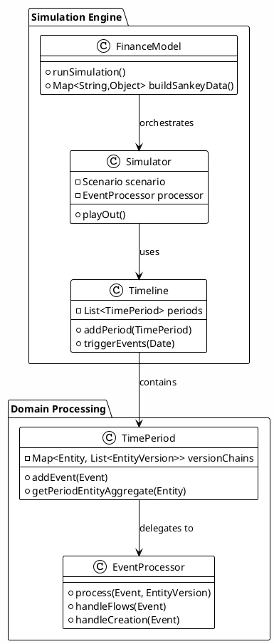

### Simulation Flow Overview

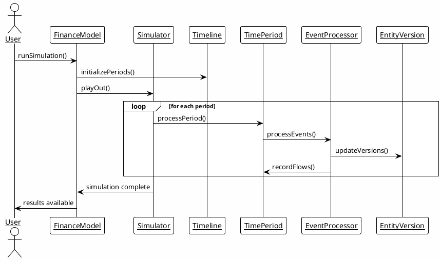

## Detailed Simulation Process

### Phase 1: Initialization

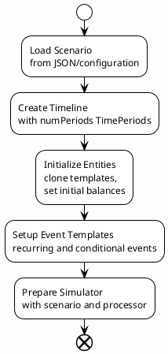

### Phase 2: Time Period Processing

Each time period goes through a structured processing pipeline:

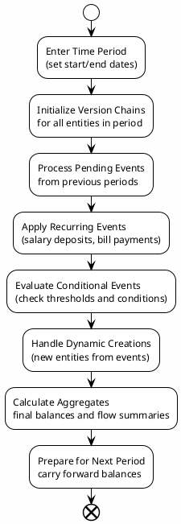

### Phase 3: Event Processing

The heart of the simulation is event processing:

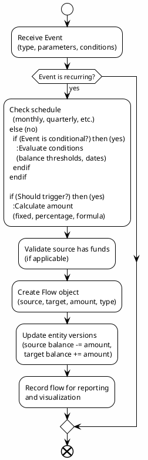

## Event Types and Processing

### Recurring Events

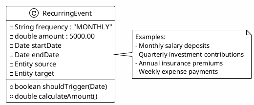

### Conditional Events

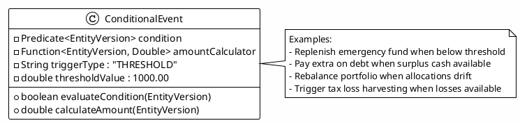

### Calculation Events

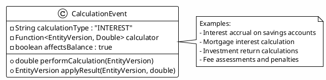

## State Management and Versioning

### Entity Version Chain

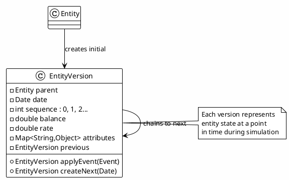

### Period State Aggregation

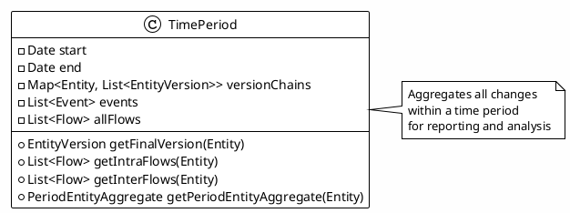

## Flow Generation and Tracking

### Flow Creation Process

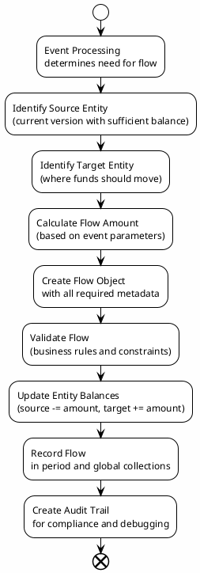

### Flow Classification

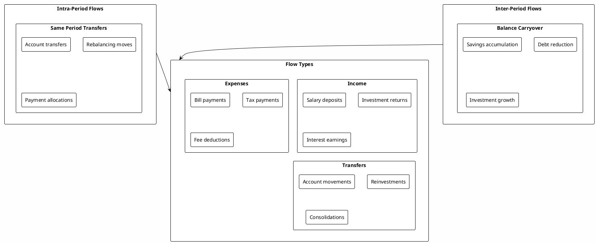

## Error Handling and Recovery

### Simulation Error Handling

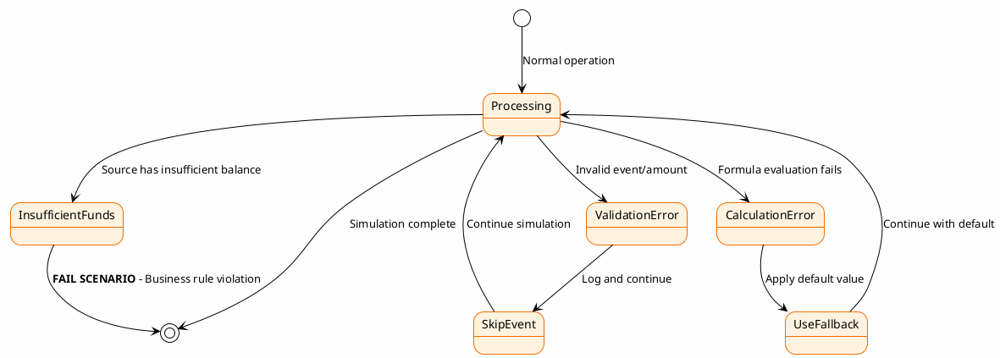

### Recovery Strategies

```plantuml
@startuml Recovery Strategies
!theme plain
skinparam backgroundColor #FEFEFE

rectangle "Validation Failures" as Validation {
  rectangle "Skip Event" as Skip {
    rectangle "Log warning"
    rectangle "Continue simulation"
    rectangle "Mark event as failed"
  }
  rectangle "Use Defaults" as Defaults {
    rectangle "Apply fallback values"
    rectangle "Log substitution"
    rectangle "Continue processing"
  }
}

rectangle "Calculation Errors" as Calculation {
  rectangle "Reduce Amount" as Reduce {
    rectangle "Use available balance"
    rectangle "Partial processing"
    rectangle "Log reduction"
  }
  rectangle "Defer Processing" as Defer {
    rectangle "Move to next period"
    rectangle "Retry with updated state"
    rectangle "Track deferred items"
  }
}

rectangle "System Failures" as System {
  rectangle "Graceful Degradation" as Degrade {
    rectangle "Disable complex features"
    rectangle "Use simplified models"
    rectangle "Maintain core functionality"
  }
  rectangle "Checkpoint Recovery" as Checkpoint {
    rectangle "Save periodic state"
    rectangle "Resume from last good state"
    rectangle "Log recovery actions"
  }
}
@enduml
```

## Performance Optimization

### Caching Strategy

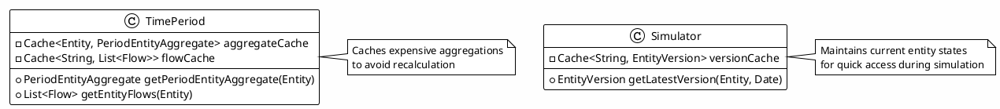

### Parallel Processing

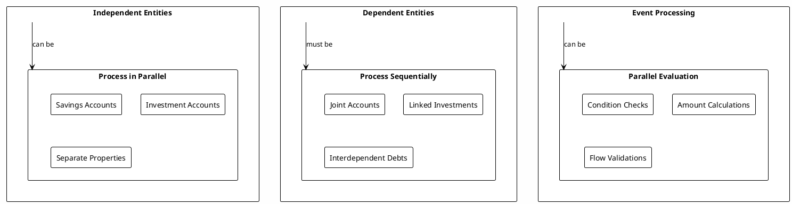

## Testing and Validation

### Simulation Testing Strategy

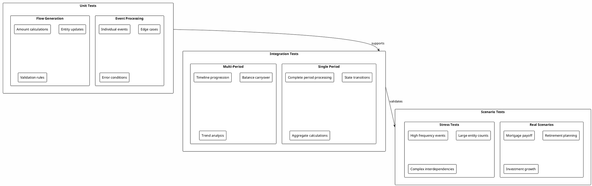

This simulation engine provides a robust, flexible foundation for modeling complex financial scenarios with accurate event processing, state management, and comprehensive error handling.