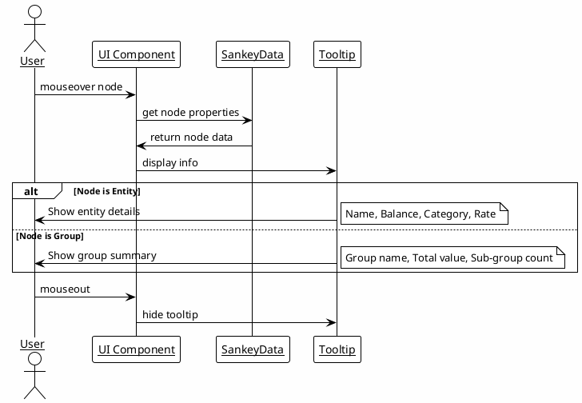
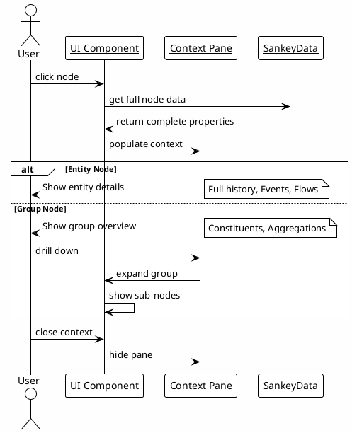
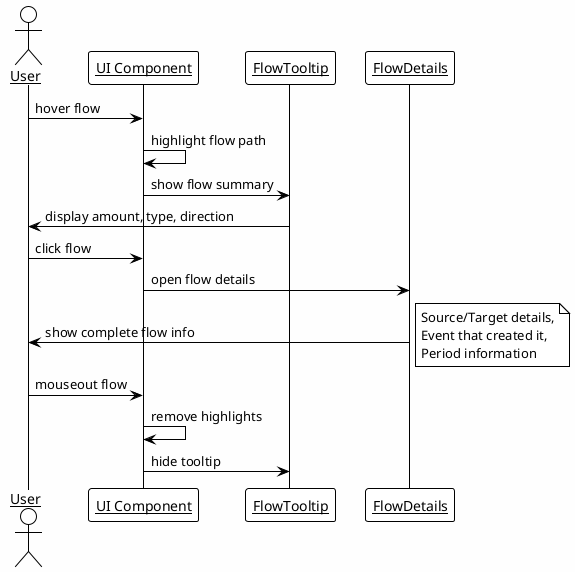
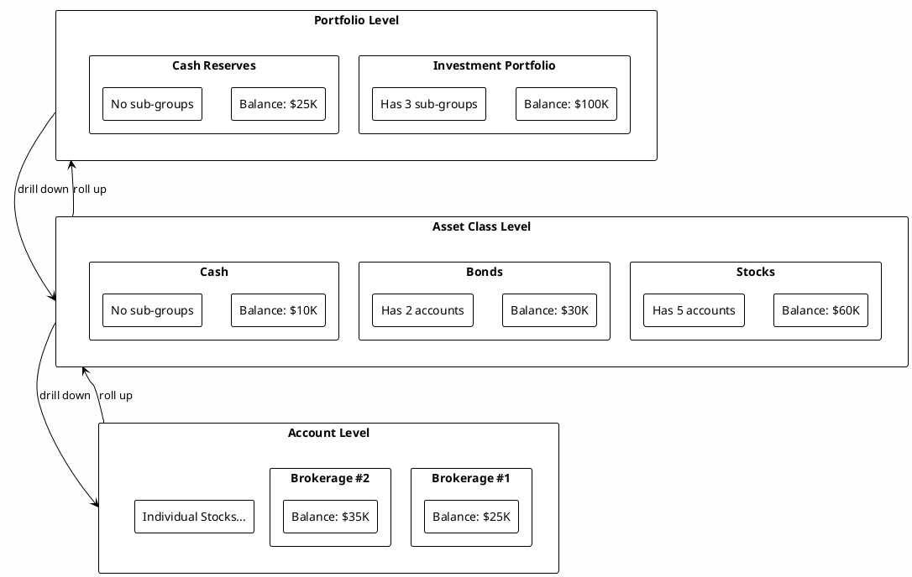
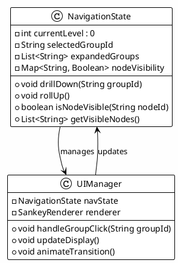

# UI Interactions - User Experience and Navigation

**Last Updated**: 2025-10-14

## Interactive Features

### Hover Interactions

### Click Interactions

### Flow Interactions

## Hierarchical Navigation

### Drill-Down Capabilities

### Navigation State Management

This interactions design ensures users can effectively explore and understand complex financial data through intuitive navigation and responsive feedback.

## See Also
- **[ui-visualization.md](ui-visualization.md)**: Data structures and visual rendering
- **[architecture.md](../design/architecture.md)**: Technical architecture and performance considerations
- **[subproject-coding-standards.md](../guidelines/subproject-coding-standards.md)**: UI theming and styling guidelines