# UI Visualization - Data Structures and Rendering

**Last Updated**: 2025-10-14

## Non-Technical Perspective

Imagine you're looking at a complex subway map showing how trains move through a city. The RatRace2025 UI turns your financial data into a similar visual experience - a Sankey diagram that shows how money flows through your financial life.

Instead of subway lines and stations, you see:
- **"Stations"** (nodes) representing your bank accounts, investments, and debts
- **"Train tracks"** (flows) showing money moving between accounts
- **Time progression** with columns representing different months or years
- **Interactive features** letting you click on elements for more details

The UI makes complex financial relationships intuitive and explorable, just like zooming in on a subway map to see transfer details.

### Real-World Analogy

Think of financial planning software as a GPS navigation system:
- **The map** shows your current financial position and destination goals
- **Route options** display different financial strategies
- **Traffic updates** represent market conditions and economic events
- **Detour suggestions** show how to avoid financial pitfalls
- **Progress tracking** monitors how well you're following your plan

RatRace2025's UI provides this GPS-like experience for your financial journey.

## Sankey Diagram Data Structure

### Core Data Format

The `buildSankeyData()` method provides a comprehensive JSON structure for UI rendering:

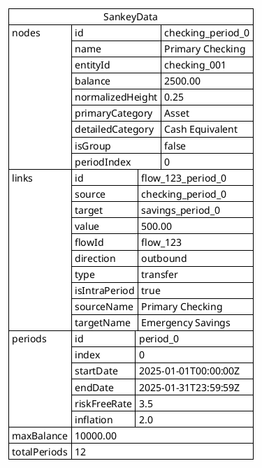

### Node Types and Properties

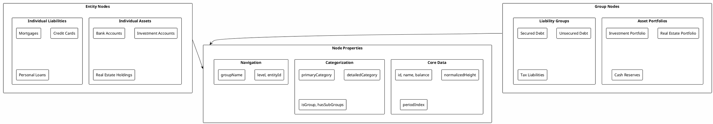

## Visual Design Principles

### Column-Based Time Layout

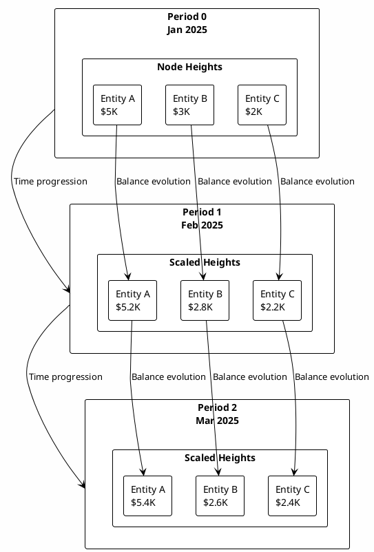

### Common Scale Calculation

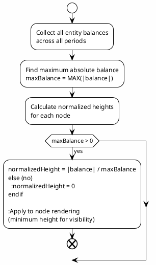

## Visual Styling and Theming

### Node Styling Rules

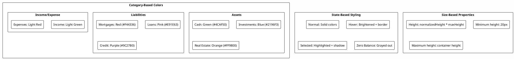

### Flow Styling Rules

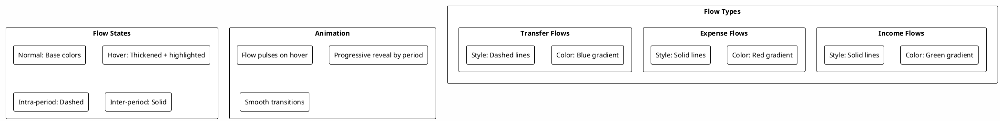

## Responsive Design

### Multi-Device Support

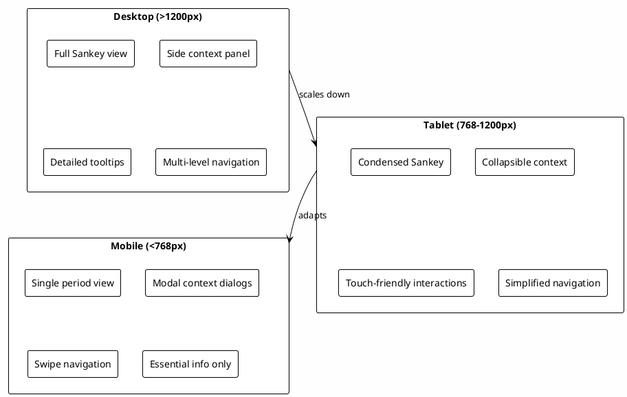

### Progressive Enhancement

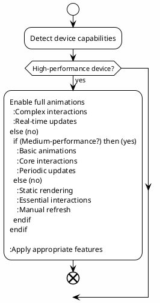

## Performance Optimization

### Rendering Optimization

### Memory Management

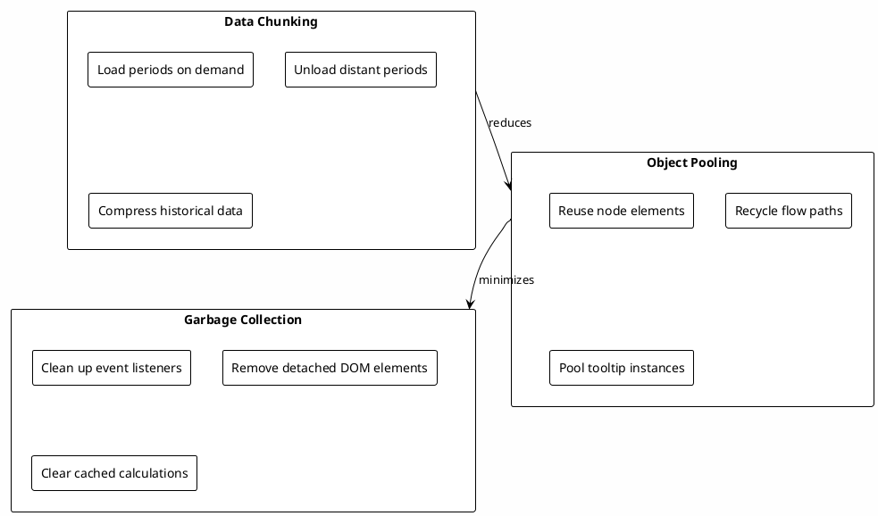

## Accessibility Features

### Keyboard Navigation

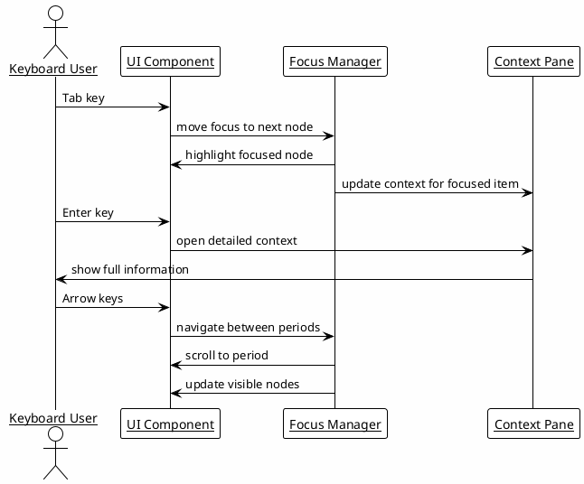

### Screen Reader Support

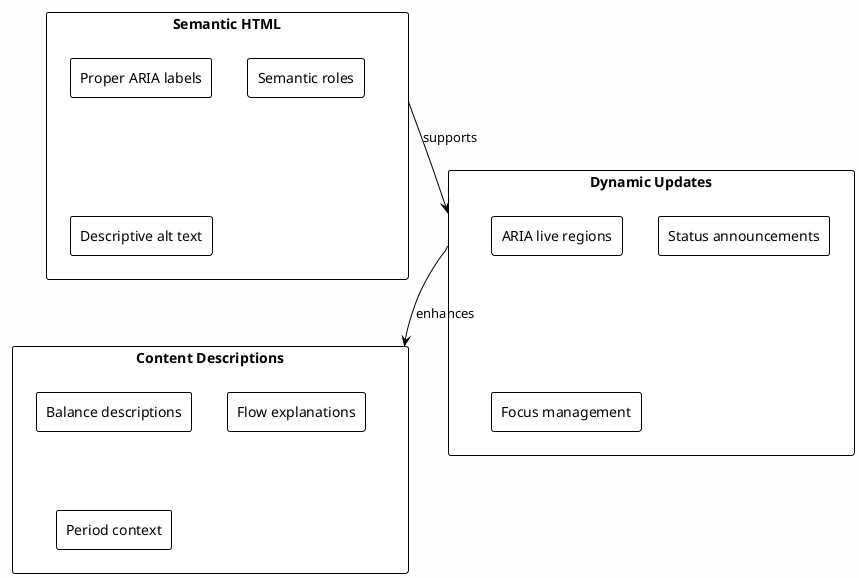

This visualization design provides a comprehensive framework for rendering complex financial data in an intuitive and accessible manner.

## See Also
- **[ui-interactions.md](ui-interactions.md)**: User interaction patterns and navigation
- **[architecture.md](../design/architecture.md)**: Technical architecture and performance considerations
- **[subproject-coding-standards.md](../guidelines/subproject-coding-standards.md)**: UI theming and styling guidelines