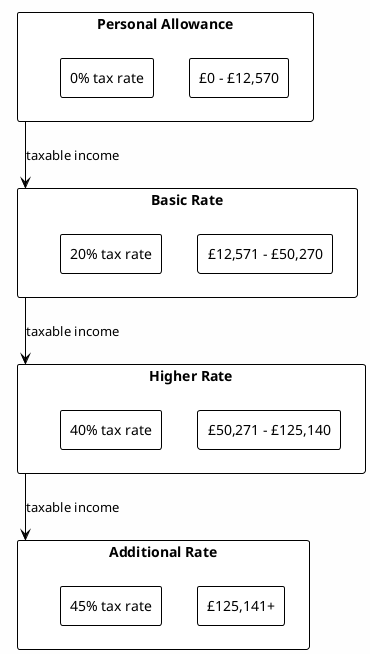
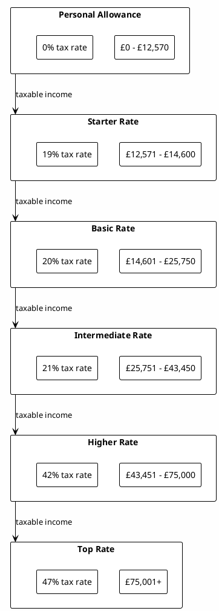
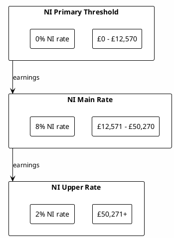
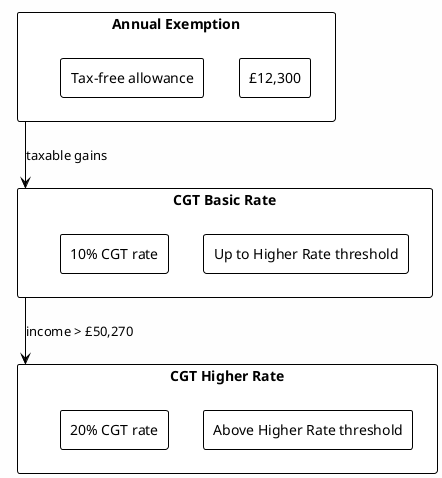
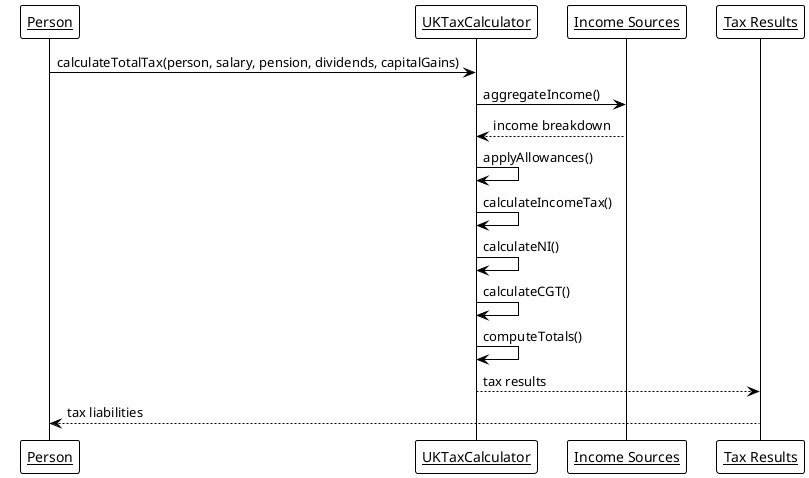

# UK Tax System Implementation

## Overview

RatRace2025 implements a comprehensive UK tax calculation engine that accurately models the UK's progressive tax system for individuals. The system handles Income Tax, National Insurance contributions, and Capital Gains Tax calculations based on the 2024/25 tax year rules.

### Key Features

- **2024/25 Tax Rules**: Complete implementation of current UK tax legislation
- **Progressive Taxation**: Accurate bracket-based tax calculations
- **Scottish Tax System**: Separate rates and thresholds for Scottish taxpayers
- **Multi-Income Sources**: Handles salary, pension, dividends, and capital gains
- **Tax Efficiency Monitoring**: Tracks effective rates and optimization opportunities
- **Allowance Optimization**: Automatically utilizes available tax allowances

## Tax Components

### 1. Income Tax

#### Tax Bands and Rates (England, Wales, Northern Ireland)



**Key Points:**
- Personal Allowance: £12,570 (2024/25)
- Tax-free up to personal allowance limit
- Marginal rates apply to income within each band
- Personal allowance reduces for high earners (tapered withdrawal)

#### Scottish Tax Bands and Rates



### 2. National Insurance (NI) Contributions

#### Employee NI Rates (2024/25)



**Key Points:**
- NI Primary Threshold: £12,570 (same as personal allowance)
- NI Upper Earnings Limit: £50,270
- Employee contributions only (no employer NI in calculations)
- Applied to salary income only

### 3. Capital Gains Tax (CGT)

#### CGT Rates (2024/25)



**Key Points:**
- Annual Exemption: £12,300 (2024/25)
- CGT rate depends on total taxable income (same thresholds as Income Tax)
- Applied to capital gains from asset sales
- Business Asset Disposal Relief and other reliefs not implemented

## Tax Calculation Process

### Calculation Flow



### Detailed Calculation Steps

#### Step 1: Income Aggregation

```java
// Aggregate all income sources for the tax year
double grossIncome = salaryIncome + pensionIncome + dividendIncome;
double totalIncome = grossIncome + capitalGains;
```

#### Step 2: Apply Tax Allowances

```java
// Calculate available allowances
double personalAllowance = 12570.00;
double marriageAllowance = person.getMarriageAllowance();
double blindPersonsAllowance = person.getBlindPersonsAllowance();

// Reduce personal allowance for high earners
if (totalIncome > 125140) {
    double reduction = (totalIncome - 125140) * 0.5;
    personalAllowance = Math.max(0, personalAllowance - reduction);
}

double totalAllowances = personalAllowance + marriageAllowance + blindPersonsAllowance;
double taxableIncome = Math.max(0, grossIncome - totalAllowances);
```

#### Step 3: Income Tax Calculation

```java
double incomeTax = 0.0;

if (person.isScottish()) {
    // Scottish tax calculation
    incomeTax = calculateScottishIncomeTax(taxableIncome);
} else {
    // England/Wales/NI tax calculation
    if (taxableIncome > 50270) {
        // Higher rate band
        incomeTax += (taxableIncome - 50270) * 0.40;
        taxableIncome = 50270;
    }
    if (taxableIncome > 12570) {
        // Basic rate band
        incomeTax += (taxableIncome - 12570) * 0.20;
    }
}
```

#### Step 4: National Insurance Calculation

```java
double nationalInsurance = 0.0;

if (salaryIncome > 50270) {
    // Upper earnings rate (2%)
    nationalInsurance += (salaryIncome - 50270) * 0.02;
    salaryIncome = 50270;
}
if (salaryIncome > 12570) {
    // Main rate (8%)
    nationalInsurance += (salaryIncome - 12570) * 0.08;
}
```

#### Step 5: Capital Gains Tax Calculation

```java
double capitalGainsTax = 0.0;
double taxableGains = Math.max(0, capitalGains - 12300); // Annual exemption

if (taxableIncome > 50270) {
    // Higher CGT rate (20%)
    capitalGainsTax = taxableGains * 0.20;
} else {
    // Basic CGT rate (10%)
    capitalGainsTax = taxableGains * 0.10;
}
```

## Tax Efficiency Monitoring

### Efficiency Metrics

The system calculates several tax efficiency metrics:

#### Effective Tax Rate
```java
double effectiveTaxRate = (totalTaxPaid / grossIncome) * 100.0;
```

#### Tax Efficiency Score
```java
String taxEfficiencyScore = calculateEfficiencyScore(effectiveTaxRate);

private String calculateEfficiencyScore(double effectiveRate) {
    if (effectiveRate < 20.0) return "EXCELLENT";
    if (effectiveRate < 25.0) return "GOOD";
    if (effectiveRate < 30.0) return "FAIR";
    if (effectiveRate < 35.0) return "POOR";
    return "VERY_POOR";
}
```

### Optimization Suggestions

The system provides automated suggestions for tax optimization:

```java
List<String> generateOptimizationSuggestions(Person person, TaxCalculationResult result) {
    List<String> suggestions = new ArrayList<>();

    // Check pension contribution opportunities
    if (person.getSalaryIncome() > 0 && person.getPensionContributions() < 0.05) {
        suggestions.add("Consider increasing pension contributions to reduce taxable income");
    }

    // Check dividend allowance utilization
    if (person.getDividendIncome() > 1000 && result.getDividendTax() > 0) {
        suggestions.add("Utilize dividend allowance (£1,000) to reduce dividend tax");
    }

    // Check capital gains tax efficiency
    if (result.getCapitalGainsTax() > 0) {
        suggestions.add("Consider tax-loss harvesting to offset capital gains");
    }

    // Check high effective rate
    if (result.getEffectiveTaxRate() > 35.0) {
        suggestions.add("Consider relocation to Scotland for lower tax rates");
    }

    return suggestions;
}
```

## Implementation Details

### UKTaxCalculator Class

```java
public class UKTaxCalculator {

    public static TaxCalculationResult calculateTotalTax(
            Person person,
            double salaryIncome,
            double pensionIncome,
            double dividendIncome,
            double capitalGains) {

        // Aggregate incomes
        double grossIncome = salaryIncome + pensionIncome + dividendIncome;

        // Apply allowances
        double taxableIncome = calculateTaxableIncome(person, grossIncome);

        // Calculate each tax component
        double incomeTax = calculateIncomeTax(person, taxableIncome);
        double nationalInsurance = calculateNationalInsurance(salaryIncome);
        double capitalGainsTax = calculateCapitalGainsTax(capitalGains, taxableIncome);

        // Calculate totals
        double totalTax = incomeTax + nationalInsurance + capitalGainsTax;
        double effectiveRate = grossIncome > 0 ? (totalTax / grossIncome) * 100 : 0;

        return new TaxCalculationResult(
            grossIncome, taxableIncome, incomeTax,
            nationalInsurance, capitalGainsTax, totalTax, effectiveRate
        );
    }
}
```

### TaxCalculationResult Class

```java
public class TaxCalculationResult {
    private final double grossIncome;
    private final double taxableIncome;
    private final double incomeTax;
    private final double nationalInsurance;
    private final double capitalGainsTax;
    private final double totalTaxPaid;
    private final double effectiveTaxRate;

    // Constructor and getters...
}
```

### Integration with Person Component

```java
public class Person implements ScenarioComponent {
    // ... existing fields ...

    private TaxCalculationResult taxResults;

    public void setTaxResults(double grossIncome, double taxableIncome,
                            double incomeTax, double nationalInsurance,
                            double capitalGainsTax) {
        this.taxResults = new TaxCalculationResult(
            grossIncome, taxableIncome, incomeTax,
            nationalInsurance, capitalGainsTax,
            incomeTax + nationalInsurance + capitalGainsTax,
            calculateEffectiveRate(grossIncome, incomeTax + nationalInsurance + capitalGainsTax)
        );
    }

    public TaxCalculationResult getTaxResults() {
        return taxResults;
    }

    private double calculateEffectiveRate(double gross, double tax) {
        return gross > 0 ? (tax / gross) * 100.0 : 0.0;
    }
}
```

## Testing and Validation

### Tax Calculation Tests

```java
@Test
public void testBasicRateTaxpayer() {
    Person person = createBasicRatePerson();
    TaxCalculationResult result = UKTaxCalculator.calculateTotalTax(
        person, 40000.0, 0.0, 0.0, 0.0
    );

    assertEquals(12570.0, result.getPersonalAllowanceUsed(), 0.01);
    assertEquals(27430.0, result.getTaxableIncome(), 0.01);
    assertEquals(5486.0, result.getIncomeTax(), 0.01); // 27430 * 0.20
    assertEquals(2316.0, result.getNationalInsurance(), 0.01);
}

@Test
public void testScottishTaxpayer() {
    Person scottishPerson = createScottishPerson();
    TaxCalculationResult result = UKTaxCalculator.calculateTotalTax(
        scottishPerson, 60000.0, 0.0, 0.0, 0.0
    );

    // Scottish rates should apply
    assertTrue(result.getIncomeTax() < 60000.0 * 0.40); // Less than highest UK rate
}
```

## Limitations and Future Enhancements

### Current Limitations
- No Business Asset Disposal Relief implementation
- No Entrepreneurs' Relief
- No treatment of carried-forward losses
- Simplified CGT calculation (no uplift on death)
- No corporation tax for business components
- No inheritance tax calculations

### Future Enhancements
- [ ] Business reliefs and allowances
- [ ] Loss carry-forward mechanisms
- [ ] Inheritance tax modeling
- [ ] Corporation tax for self-employed/business components
- [ ] Tax year straddling calculations
- [ ] Automatic tax payment planning

## Compliance and Accuracy

The UK tax implementation aims to accurately reflect 2024/25 tax rules as published by HMRC. However:

⚠️ **Important**: This is a simulation tool for educational and planning purposes. It should not be used as a substitute for professional tax advice or official HMRC calculations. Tax rules can change, and individual circumstances may qualify for additional reliefs or have special considerations not modeled here.

### Validation Sources
- HMRC Tax Tables 2024/25
- Official UK Government tax documentation
- Professional tax calculation references
- Cross-verification with multiple tax calculation tools