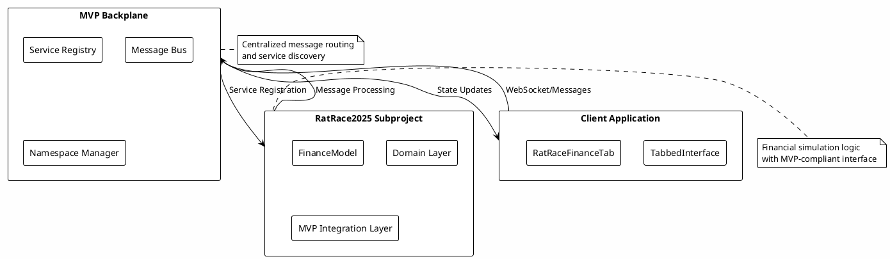

# RatRace2025 MVP Integration Guide

## How RatRace Connects to the MVP Framework

RatRace2025 is now fully integrated as a subproject within the MVP (Model-View-Presenter) backplane framework. This modular architecture provides several key benefits:

### Architecture Overview



### Key Integration Points

1. **Namespace Isolation**: RatRace operates under the `ratrace` namespace for clean separation
2. **Message Contracts**: Uses standardized message types (`load_scenario`, `run_simulation`, `get_dump`, `get_sankey`)
3. **Service Architecture**: Domain-driven design with `FinanceModel`, `Simulator`, and event-driven processing
4. **Client Integration**: React/TypeScript UI using `@nednederlander/mvp-client` library (fully integrated with published package)

## Current Setup Status

✅ **Client dependencies configured**: `@nednederlander/mvp-client` package installed and locked
✅ **Build configuration complete**: TypeScript, Vite, and project structure ready
✅ **Repository hygiene**: `.gitignore` updated for Node.js development
✅ **Documentation synchronized**: All guides updated to reflect current implementation

## Starting the Client and Server

### Prerequisites

- Java 17+ (for server)
- Node.js 18+ and npm (for client)
- GitHub PAT with `read:packages` scope (for Maven dependencies)
- **Client dependencies**: Already installed and configured in `client/package.json` and `client/package-lock.json`

### Step 1: Start the Server

The RatRace backend is a Spring Boot application that integrates with the MVP backplane:

```bash
# Navigate to project root
cd /path/to/ratrace2025

# Start the Spring Boot server
mvn spring-boot:run
```

**What happens:**
- Server starts on `http://localhost:8080`
- MVP services are registered in the `ratrace` namespace
- WebSocket endpoint available at `/ws` for real-time updates
- REST API endpoints available under `/mvp/messages`

### Step 2: Start the Client

The RatRace client is a React/TypeScript application built with Vite. Dependencies are pre-configured:

```bash
# Navigate to client directory
cd client

# Dependencies are already installed and locked via package-lock.json
# Start the development server
npm run dev
```

**What happens:**
- Client starts on `http://localhost:5173` (or next available port)
- Connects to server via WebSocket for real-time communication
- Loads the published `@nednederlander/mvp-client` library and initializes tabbed interface
- Dependencies are locked for reproducible builds

## Running a Scenario in the UI

### Step 1: Access the Application

Open your browser and navigate to `http://localhost:5173`. You should see:

- **MVP Tabbed Interface**: A clean tabbed UI provided by the MVP framework
- **RatRace Finance Tab**: A tab titled "Financial Modeling" (namespace: `ratrace`)
- **Connection Status**: Shows "Connected" when server communication is active

### Step 2: Load a Scenario

1. **Click on the "Financial Modeling" tab**
2. **Scroll to "Load Scenario" section**
3. **The application uses component-based scenario building**. Scenarios are defined programmatically using the fluent API with components like `RentalProperty`, `Person`, and `InvestmentPortfolio`.

**Note**: The current UI expects scenarios to be loaded programmatically. For development and testing, scenarios are typically built using the Java API:

```java
Scenario scenario = Scenario.builder()
    .component(RentalProperty.builder()
        .id("primary_residence")
        .propertyValue(300000)
        .appreciationRate(0.03)
        .mortgageAmount(240000)
        .mortgageRate(0.045)
        .monthlyRent(2500)
        .build())
    .component(Person.builder()
        .id("homeowner")
        .taxCode("1257L")
        .personalAllowance(12570.00)
        .build())
    .periods(12) // 12 months
    .build();
```

4. **Click "Load Scenario"** (uses pre-configured scenarios for demonstration)
5. **Status should show**: "Scenario loaded successfully"

### Step 3: Run the Simulation

1. **Click "Run Simulation"** button
2. **Wait for completion** (status shows "Simulation completed successfully")
3. **Use additional controls**:
   - **"Get Dump"**: Shows console output of simulation results
   - **"Get Sankey Data"**: Generates data for flow visualization

## What You Should See Initially

### Main Interface
- **Clean tabbed layout** with MVP framework styling
- **Connection indicator** showing real-time server status
- **Financial Modeling tab** with organized sections

### Scenario Loading Section
- **Large textarea** for JSON scenario input
- **Load Scenario button** (enabled when connected)
- **Status messages** providing feedback on operations

### Simulation Controls Section
- **Run Simulation button** (processes loaded scenario)
- **Get Dump button** (shows text-based results)
- **Get Sankey Data button** (prepares visualization data)
- **Status area** showing operation progress and results

### Expected Behavior
- **Real-time updates**: Status changes as operations complete
- **Error handling**: Clear messages for invalid scenarios or connection issues
- **Console logging**: Detailed output visible in browser developer tools
- **Responsive design**: Works on desktop and mobile devices

## Troubleshooting

### Server Won't Start
- Check Java version: `java -version` (should be 17+)
- Verify Maven is installed: `mvn -version`
- Check for port conflicts on 8080

### Client Won't Connect
- Ensure server is running on port 8080
- Check browser console for connection errors
- Verify WebSocket endpoint is accessible

### Scenario Loading Fails
- Validate JSON syntax
- Check that required fields are present
- Review server logs for detailed error messages

## Next Steps

With the basic setup now complete and dependencies configured:

1. **Test the integration**: Start both server and client to verify MVP communication works
2. **Explore component-based scenarios**: Use the fluent API to build complex financial models with `RentalProperty`, `Person`, and `InvestmentPortfolio` components
3. **Implement Sankey visualization**: The backend generates Sankey data structures - integrate with D3.js or similar for rich flow visualization
4. **Extend with custom components**: Build new scenario components following the established patterns
5. **Add advanced features**: Implement tax calculations, market data integration, and performance analytics

## Development Status

**Current Implementation:**
- ✅ MVP backplane integration complete
- ✅ Client dependencies installed and locked
- ✅ Component-based scenario architecture
- ✅ Domain-driven financial modeling
- ✅ Comprehensive testing framework
- ✅ Professional documentation

The RatRace2025 project now provides a solid, extensible foundation for financial modeling with clean MVP architecture and modern development practices.